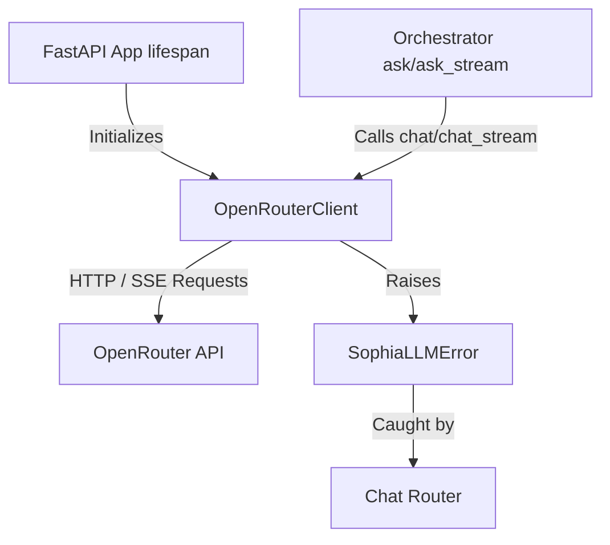

# LLM Provider Migration Plan: Groq to OpenRouter (Google Gemini)

This document details the plan to migrate the LLM provider in [SophiaAI](file:///C:/Users/serra/Desktop/SophiaAI) from Groq to OpenRouter, configuring it to use a Google model (e.g., `google/gemini-2.5-flash`).

## Success Criteria

1. **Successful Integration**: All calls to the LLM go through OpenRouter instead of Groq.
2. **Unified Error Interface**: All connection, timeout, and API errors are caught in the client wrapper and re-raised as [SophiaLLMError](file:///C:/Users/serra/Desktop/SophiaAI/sophia/llm/__init__.py) to preserve orchestrator isolation.
3. **Feature Parity**: Support both standard blocking chat (`chat`) and token-by-token streaming (`chat_stream`) using SSE.
4. **Environment-Driven Configuration**: Read key and model configuration from environment variables, fallback to a sensible Google model.
5. **Full Test Coverage**: Existing test suite runs and passes (185/185 tests) with updated mocks for the `httpx`-based OpenRouter client.

---

## Architectural Changes



### Proposed File Actions

| File Path | Action | Description |
| :--- | :--- | :--- |
| [`.env.example`](file:///C:/Users/serra/Desktop/SophiaAI/.env.example) | Modify | Replace `GROQ_` keys with `OPENROUTER_` keys. |
| [`.env`](file:///C:/Users/serra/Desktop/SophiaAI/.env) | Modify | Update development variables. |
| [`sophia/llm/openrouter_client.py`](file:///C:/Users/serra/Desktop/SophiaAI/sophia/llm/openrouter_client.py) | Create | Implement `OpenRouterClient` using `httpx`. |
| [`sophia/llm/groq_client.py`](file:///C:/Users/serra/Desktop/SophiaAI/sophia/llm/groq_client.py) | Delete | Remove the obsolete Groq client. |
| [`sophia/llm/__init__.py`](file:///C:/Users/serra/Desktop/SophiaAI/sophia/llm/__init__.py) | Modify | Update exports to use `OpenRouterClient`. |
| [`sophia/app/main.py`](file:///C:/Users/serra/Desktop/SophiaAI/sophia/app/main.py) | Modify | Instantiate `OpenRouterClient` in the lifespan startup. |
| [`sophia/app/routers/chat.py`](file:///C:/Users/serra/Desktop/SophiaAI/sophia/app/routers/chat.py) | Modify | Update import of [SophiaLLMError](file:///C:/Users/serra/Desktop/SophiaAI/sophia/llm/__init__.py). |
| [`tests/test_openrouter_client.py`](file:///C:/Users/serra/Desktop/SophiaAI/tests/test_openrouter_client.py) | Create | Complete unit test coverage for the OpenRouter client. |
| [`tests/test_groq_client.py`](file:///C:/Users/serra/Desktop/SophiaAI/tests/test_groq_client.py) | Delete | Remove the obsolete Groq client tests. |
| [`tests/test_app_chat_stream.py`](file:///C:/Users/serra/Desktop/SophiaAI/tests/test_app_chat_stream.py) | Modify | Clean up import of [SophiaLLMError](file:///C:/Users/serra/Desktop/SophiaAI/sophia/llm/__init__.py). |
| [`tests/test_orchestrator.py`](file:///C:/Users/serra/Desktop/SophiaAI/tests/test_orchestrator.py) | Modify | Clean up import of [SophiaLLMError](file:///C:/Users/serra/Desktop/SophiaAI/sophia/llm/__init__.py). |

---

## Detailed Step-by-Step Implementation

### Step 1: Configuration Updates
1. Replace `GROQ_API_KEY` and `GROQ_MODEL` with `OPENROUTER_API_KEY` and `OPENROUTER_MODEL` in [`.env.example`](file:///C:/Users/serra/Desktop/SophiaAI/.env.example) and [`.env`](file:///C:/Users/serra/Desktop/SophiaAI/.env).
2. Set default model: `OPENROUTER_MODEL=google/gemini-2.5-flash`.

### Step 2: Implement OpenRouter Client
Create [`sophia/llm/openrouter_client.py`](file:///C:/Users/serra/Desktop/SophiaAI/sophia/llm/openrouter_client.py) using the built-in `httpx` package.
- Initialize `httpx.Client(base_url="https://openrouter.ai/api/v1")`.
- Expose the exact signature of `chat(messages, model)` and `chat_stream(messages, model)`.
- Extract SSE chunks dynamically in `chat_stream`.
- Wrap all HTTP client exceptions and API error status codes into [SophiaLLMError](file:///C:/Users/serra/Desktop/SophiaAI/sophia/llm/__init__.py).

### Step 3: Decouple Imports
Modify [`sophia/llm/__init__.py`](file:///C:/Users/serra/Desktop/SophiaAI/sophia/llm/__init__.py):
```python
from sophia.llm.openrouter_client import OpenRouterClient, SophiaLLMError

__all__ = ["OpenRouterClient", "SophiaLLMError"]
```
Update all other imports of `SophiaLLMError` to import directly from `sophia.llm` rather than `sophia.llm.groq_client` to avoid tight coupling.

### Step 4: Write Unit Tests
Create [`tests/test_openrouter_client.py`](file:///C:/Users/serra/Desktop/SophiaAI/tests/test_openrouter_client.py):
- Mock `httpx.Client.post` for the synchronous `chat` path.
- Mock `httpx.Client.stream` and return mock line generator for the `chat_stream` SSE path.
- Verify status code handling, empty responses, error handling, rate limiting, and normal delta generation.
- Add skip-if-no-api-key integration test targeting OpenRouter.

### Step 5: Clean Up and Verify
1. Remove `groq` specific files: [`sophia/llm/groq_client.py`](file:///C:/Users/serra/Desktop/SophiaAI/sophia/llm/groq_client.py) and [`tests/test_groq_client.py`](file:///C:/Users/serra/Desktop/SophiaAI/tests/test_groq_client.py).
2. Run pytest:
   ```powershell
   .\SophiaAI-venv\Scripts\pytest
   ```
3. Commit and verify.
